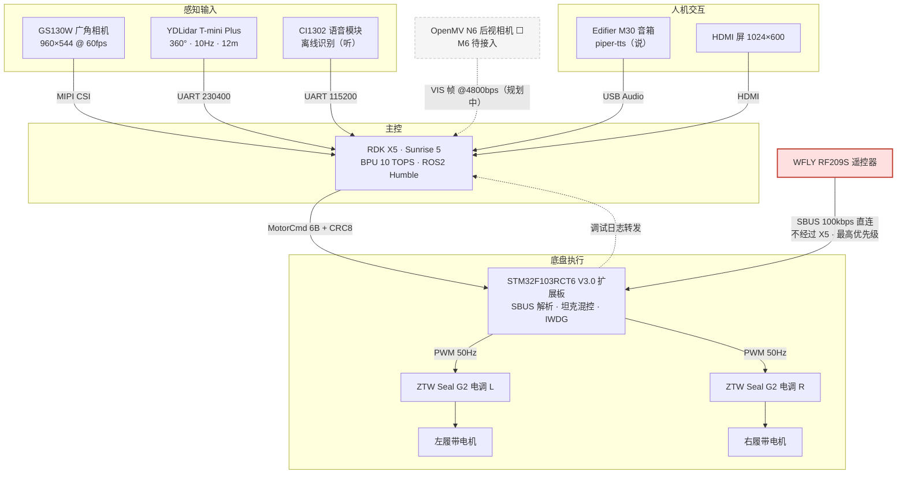
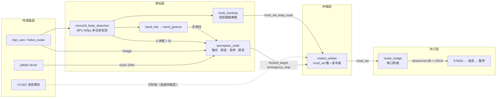

# Heavy Tracked Vehicle — RDK X5 Autonomous Follower

[](https://docs.ros.org/en/humble/)
[](https://developer.d-robotics.cc/rdk_doc/RDK)
[](https://www.python.org/)
[](./LICENSE)

> 以地平线 RDK X5 为大脑、亚博 STM32 V3.0 扩展板为小脑、BPU 人体检测 + LiDAR-Camera EKF 融合测距为感知链的**重载履带自主跟随机器人**。

---

## 📖 概述

本项目将一套原基于 **ESP32 + OpenMV** 的履带跟随车迁移至 **RDK X5 + STM32 ROS 主控板** 架构，实现：

- **BPU 人体检测 + LiDAR-Camera EKF 融合测距** — mono2d_body_detection (BPU, ~60FPS) + T-mini Plus 2D LiDAR (10Hz) → 角度匹配 → 常速度 EKF → 公制距离
- **语音仲裁跟随** — motion_arbiter 状态机 (VOICE_MANUAL / FOLLOWING) 作为 /cmd_vel 唯一发布者, LiDAR 距离覆写线速度
- **分层安全架构** — 遥控器 SBUS 直连 STM32 最高优先级, X5 指令次之, 2s 命令超时 + IWDG 硬件看门狗兜底
- **离线中文语音交互** — CI1302 V7 (ASR 输入, A5 FA 协议) + M30 桌面扬声器 (piper-tts TTS 输出)
- **全 ROS2 Humble + TROS 生态** — 一键 `ros2 launch tracked_vehicle person_follow.launch.py` 启动 12 节点管线

---

## 🏗️ 硬件架构



### 安全优先级

```
SBUS 遥控器 (STM32 直连)  ▸  最高优先，X5 指令可被覆盖
RDK X5 自主指令 (UART)    ▸  遥控器断开时生效
超时关断 (2s 无新命令)     ▸  STM32 硬件级安全兜底
```

---

## 📋 物料清单 (BOM)

| 组件     | 型号 / 规格                                  | 用途                        |
| -------- | -------------------------------------------- | --------------------------- |
| 主控计算 | **RDK X5** (X5U SoC, 10 TOPS BPU, 4GB) | 视觉推理、决策、ROS2 主节点 |
| 底盘控制 | **亚博 STM32 ROS 扩展板 V3.0**         | 电机控制、IMU、SBUS 接收    |
| 双目相机 | RDK GS130W (或 132GS) MIPI 双目              | 人体检测 + 深度测距         |
| 激光雷达 | 亚博 T-mini Plus (12m)                       | 避障、环境感知              |
| 语音模块 | 亚博 AI 语音交互模块                         | 语音指令控制                |
| 后视相机 | OpenMV Cam N6                                | 后视人体检测                |
| 无刷电调 | ZTW Seal G2 ×2                              | 双路三相无刷电机驱动        |
| 动力电机 | 三相无刷 ×2                                 | 履带驱动                    |
| 电源     | 48V 89Ah 锂电池                              | 全车供电                    |
| 遥控器   | 专业遥控器 + SBUS 接收机                     | 手动操控、安全覆盖          |

---

## 🧠 软件架构



---

## 📁 目录结构

✅ 已实现　⬜ 待实现

```
tracked-vehicle-rdk/
├── README.md                         # 📖 项目总览（本文件）
├── LICENSE                           # ⚖️ MIT 开源协议
├── .gitignore                        # 🙈 Git 忽略规则
├── CHANGELOG.md                      # 📋 版本更新日志
│
├── docs/                             # 📝 设计文档
│   ├── hardware-setup.md             #    ✅ 硬件连线与接口对表
│   ├── protocol-spec.md              #    ✅ 全部协议权威来源 (MotorCmd/SBUS/CI1302/PWM/VIS)
│   ├── stereo-vision-verification.md #    ✅ 双目视觉验证报告
│   ├── stereo-depth-exploration.md   #    ✅ 双目深度方案技术探索 (BPU争用,结论:不可并发)
│   ├── lessons-learned.md            #    ✅ 踩坑经验记录 (35条)
│   ├── ROS-ExpansionboardV3.0-en-new-20250509.pdf    #    ✅ STM32 扩展板手册
│
├── launch/                           # 🚀 ROS2 launch 文件
│   ├── stereo_vision.launch.py       #    ✅ 双目采集 + StereoNet 深度图 (独立实验,非主线)
│   ├── motor_bridge.launch.py        #    ✅ X5↔STM32 串口桥接 (独立启动)
│   └── person_follow.launch.py       #    ✅ 语音+手势人体跟随 (12 节点流水线)
│
├── src/tracked_vehicle/              # 🐍 ROS2 包 (v0.10.0)
│   ├── setup.py                      #    ✅ colcon 构建配置
│   ├── setup.cfg                     #    ✅ 可执行文件路径
│   ├── package.xml                   #    ✅ ROS2 依赖声明
│   ├── resource/tracked_vehicle      #    ✅ 包标记文件
│   └── tracked_vehicle/              #    核心 Python 模块
│       ├── __init__.py               #    ✅ 包初始化
│       ├── motor_bridge.py           #    ✅ /cmd_vel → MotorCmd 串口桥接 (CRC-8/自动重连)
│       ├── perception_node.py        #    ✅ 感知权威: LiDAR融合+手势锁定+HDMI屏显+系统监控
│       ├── motion_arbiter.py         #    ✅ 运动仲裁: CI1302语音+FOLLOW距离覆写 (/cmd_vel唯一发布者)
│       └── lidar_fusion.py           #    ✅ LiDAR-Camera 融合引擎 (聚类+角度匹配+EKF+速率解耦)
│
├── models/                           # 🧠 BPU 模型 (由 apt 管理) ✅
├── ci1302_firmware/                   # 🎙️ CI1302 语音模块固件 ✅
│   ├── 命令词播报词协议列表V7_瓦力履带车.xlsx  #    V7 协议 (被动播报, M30 TTS 输出)
│   └── sfw20260727161528158195790/        #    V7 固件 (V01843 SDK, 2026-07-27)
│       ├── CI1302_chinese_1mic_V01843_UART1_115200_2M.bin
│       └── readme.txt
│
├── stm32_firmware/                   # 🔩 STM32 扩展板固件 V3.0 ✅
│   ├── platformio.ini                #    PlatformIO 构建 (STM32F103RCT6)
│   ├── flash_stm32.sh                #    ✅ 一键烧录脚本
│   └── src/
│       ├── main.cpp                  #    SBUS + MotorCmd + 坦克混控 + IWDG
│       └── config.h                  #    引脚/协议常量
├── openmv_rear/                      # 👁️ 后视辅助 ⬜
└── tests/                            # 🧪 单元测试 ⬜
```

---

## 🔌 通信协议

详见 **[docs/protocol-spec.md](docs/protocol-spec.md)** — 所有协议的单一权威来源.

| 协议         | 方向            | 用途                              |
| ------------ | --------------- | --------------------------------- |
| MotorCmd     | X5 → STM32     | 运动指令 (6B, 115200bps, CRC-8)   |
| SBUS         | 遥控器 → STM32 | 手控接管 (25B, 100kbps, CH5/CH6)  |
| CI1302 A5 FA | X5 ← CI1302    | 语音识别输入 (V7被动, 8B, 115200) |
| PWM          | STM32 → ESC    | 双路电调 (50Hz, 1000-2000μs)     |
| VIS          | OpenMV → X5    | 后视辅助 (ASCII, 4800bps)         |

---

## 🛡️ 安全机制

| 层级 | 机制                        | 描述                                                                  |
| ---- | --------------------------- | --------------------------------------------------------------------- |
| L1   | **SBUS 遥控器优先**   | 遥控器直连 STM32，指令硬件级优先于 X5                                 |
| L1.5 | **IWDG 硬件看门狗**   | STM32 独立看门狗 4s 超时，主循环异常时自动复位 MCU → ESC 掉信号刹停  |
| L2   | **命令超时刹停**      | X5 超过 2s 无新 MotorCmd → STM32 自动切中位 + 蜂鸣锁定               |
| L3   | **X5 安全看门狗**     | motor_bridge: 60s 无 /cmd_vel → 发停止帧 (X5端, 独立于STM32端2s超时) |
| L4   | **电调物理保护**      | ZTW Seal G2 内置过流/过热/堵转保护                                    |
| L5   | **视觉丢帧暂留**      | body_tracking: 丢失 ≤150 帧维持上一指令, 避免急刹                    |
| L6   | **串口自动恢复**      | motor_bridge / motion_arbiter: 写失败自动重连                         |
| L7   | **LiDAR 紧急制动** ✅ | perception_node: 前方 0.5m/±15° 障碍物 → /emergency_stop           |

---

## 🚀 快速开始

### 前置条件

```bash
# 1. RDK X5 已刷 RDK OS 3.x (Ubuntu 22.04 + ROS2 Humble + TROS)
cat /etc/version
source /opt/tros/humble/setup.bash

# 2. TROS 依赖 (人体检测/跟随/手势)
sudo apt install -y tros-humble-mono2d-body-detection tros-humble-body-tracking
sudo apt install -y tros-humble-hand-lmk-detection tros-humble-hand-gesture-detection

# 3. Python 依赖
pip3 install pyserial numpy opencv-python
```

### 克隆与构建

```bash
cd ~/Desktop
git clone https://github.com/ItsTonyMei/tracked-vehicle-rdk.git
cd tracked-vehicle-rdk

source /opt/tros/humble/setup.bash
colcon build --symlink-install
source install/setup.bash
```

### 烧录 STM32 固件

```bash
cd stm32_firmware
# 手动进 bootloader: 按住 BOOT0 → 按 RESET → 松 BOOT0
python -m platformio run --target upload
# 或使用 flash 脚本: bash flash_stm32.sh firmware.bin
```

> V3.0 CH340N DTR/RTS 未接 NRST/BOOT0, 不支持自动下载。

### 人体跟随 + 电机控制（已实现）

```bash
# 前置步骤: 安装 TROS 人体检测模型
sudo apt install -y tros-humble-mono2d-body-detection tros-humble-body-tracking

# 构建本项目
cd ~/Desktop/tracked-vehicle-rdk
colcon build --packages-select tracked_vehicle
source install/setup.bash

# 一键启动: 手势唤醒人体跟随 (OK=锁定, Palm=解除)
# STM32 需通过 Micro USB 连接到 RDK X5 的 USB 口
ros2 launch tracked_vehicle person_follow.launch.py
```

### 子系统独立启动

```bash
# 仅串口桥接 (需先启动 body_tracking)
ros2 launch tracked_vehicle motor_bridge.launch.py

# 仅双目 + 深度 (独立实验, 不与 person_follow 并发)
ros2 launch tracked_vehicle stereo_vision.launch.py
```

---

## 📚 文档索引

| 文档                                                                                                | 内容                                               |
| --------------------------------------------------------------------------------------------------- | -------------------------------------------------- |
| [docs/hardware-setup.md](./docs/hardware-setup.md)                                                   | ✅ 硬件连线与接口对表                              |
| [docs/protocol-spec.md](./docs/protocol-spec.md)                                                     | ✅ 全部协议权威来源 (MotorCmd/SBUS/CI1302/PWM/VIS) |
| [docs/stereo-vision-verification.md](./docs/stereo-vision-verification.md)                           | ✅ 双目视觉验证报告                                |
| [docs/stereo-depth-exploration.md](./docs/stereo-depth-exploration.md)                               | ✅ 双目深度方案技术探索                            |
| [docs/lessons-learned.md](./docs/lessons-learned.md)                                                 | ✅ 踩坑经验记录 (42条)                             |
| [docs/ROS-ExpansionboardV3.0-en-new-20250509.pdf](./docs/ROS-ExpansionboardV3.0-en-new-20250509.pdf) | ✅ STM32 扩展板手册                                |

---

## 🛤️ 路线图

- [X] M1：硬件选型与采购
- [X] M2：目录结构与项目骨架
- [X] M3：STM32 固件适配（SBUS + MotorCmd 双源 + IWDG）
- [X] M4：RDK X5 感知验证
  - [X] 人体检测+手势 (mono2d_body_detection + hand @ ~30FPS)
  - [X] 双目深度技术验证 (StereoNet @ 21FPS, 结论: 不可与检测并发)
  - [X] cmd_vel → MotorCmd 串口桥接
- [X] M5：跟随系统
  - [X] 人体跟随 (TROS body_tracking + motion_arbiter 仲裁)
  - [X] LiDAR-Camera 融合测距 (聚类+角度匹配+EKF, 纯 LiDAR 距离)
  - [X] 手势锁定 (OK + Victory ✌️ 并行) + 滑动窗口投票 + 空间 fallback
  - [X] HDMI 本地屏显 (1024×600, 系统监控 + CPU/BPU/MEM)
  - [X] CI1302 V7 语音模块 (被动播报, A5FA 仅识别帧 → M30 TTS 输出)
  - [X] systemd 开机自启 (启动 20s)
- [ ] M6：后视摄像头接入 (OpenMV VIS 帧解析)
- [X] M7：LiDAR 紧急制动 (perception_node /emergency_stop + 被锁人豁免, v0.9.0)
- [X] M8：场地实车测试

---

## 🤝 贡献指南

1. Fork 本仓库
2. 创建特性分支：`git checkout -b feat/xxx`
3. 遵循现有代码风格（Python: PEP8, C++: Google Style）
4. 提交 Pull Request 并描述变更

---

## 📄 许可证

本项目基于 **MIT License** 开源。详见 [LICENSE](./LICENSE)。

---

## 🙏 致谢

- [地平线 D-Robotics](https://developer.d-robotics.cc/) — RDK X5 硬件与 TROS 生态
- [亚博智能 Yahboom](https://www.yahboom.com/) — STM32 ROS 扩展板与传感器套装
- 原 ESP32+OpenMV 项目 (6wd-follower-esp32-openmv) — 跟随算法与协议设计基础

---

<p align="center">
  <b>Built with ❤️ on RDK X5 · ROS2 Humble · TROS</b>
</p>
