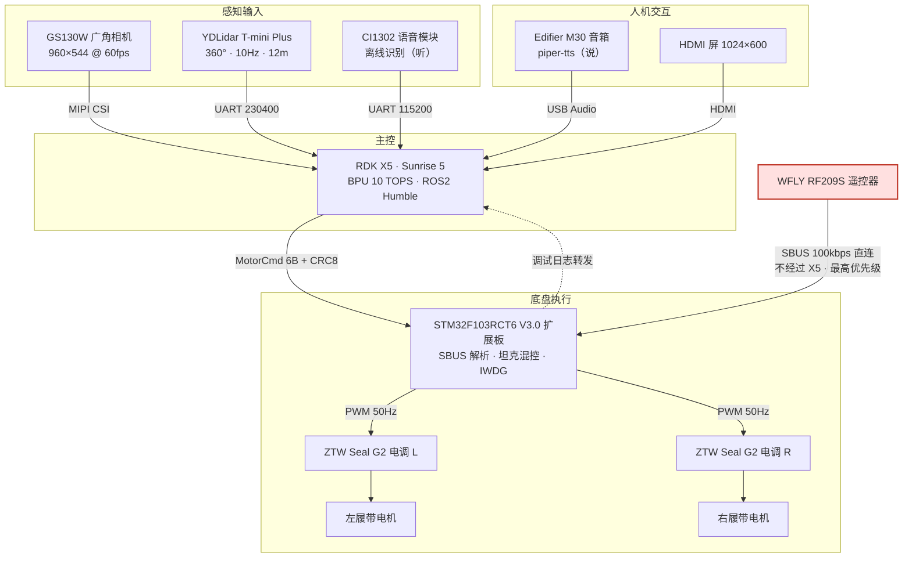
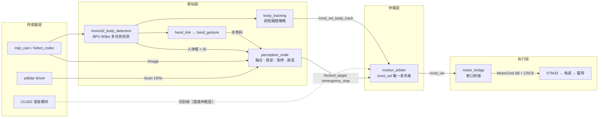
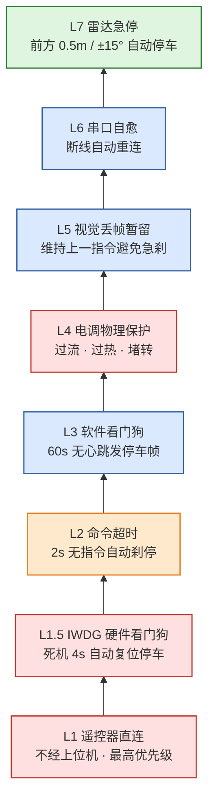
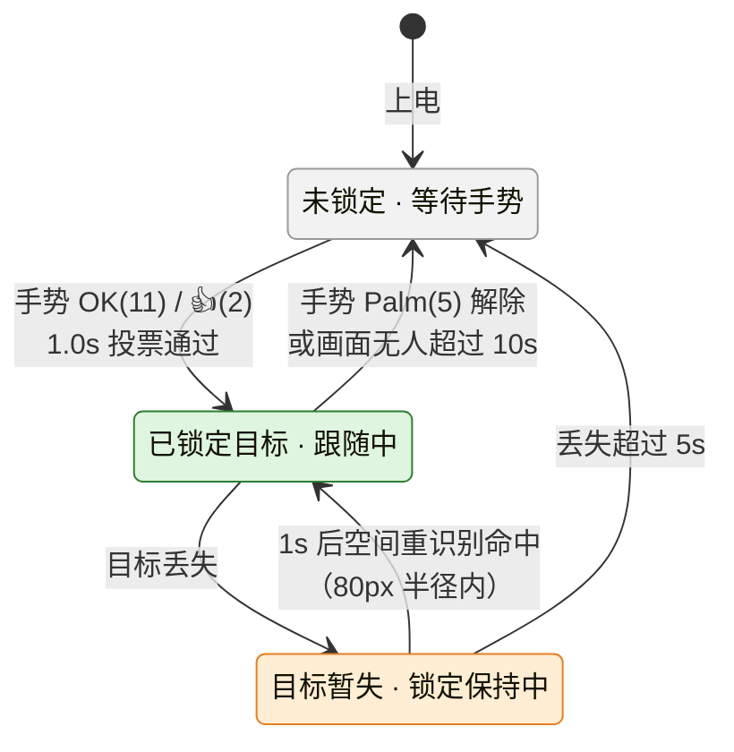
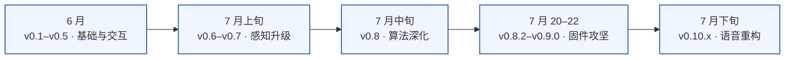

# 瓦力履带车自主跟随系统 · 项目总结报告

> Heavy Tracked Vehicle · RDK X5 Autonomous Follower
>
> 报告日期：2026-08-05

| 项目 | 内容 |
| --- | --- |
| 项目代号 | 瓦力（WALL-E） |
| 系统构成 | 重型履带车 · RDK X5 主控 · STM32 底盘控制 |
| 研发周期 | 2026-06-16 ~ 2026-07-29（44 天，23 个开发日） |
| 当前版本 | v0.10.1 |
| 代码规模 | 3,768 行（Python 2,679 / C++ 807 / Launch 282） |
| 工程提交 | 135 次 |
| 里程碑 | M1–M5、M7 完成；M6（后视相机）、M8（场地实车测试）待办 |

---

## 摘要

本项目将一套基于 ESP32 + OpenMV 的履带跟随车，升级为以地平线 RDK X5 为主控、STM32 扩展板为底盘控制器的自主跟随机器人，实现人体检测、精确测距、手势指定锁定、离线语音交互与多层安全防护。

系统采用"单目视觉检测 + 激光雷达 EKF 融合测距"方案：测距精度由像素估算的 ±30% 提升至约 2cm；手势锁定在多人同框场景下约 1 秒内锁定指定目标，不再跟错人；语音识别与合成全链路离线，不依赖网络与云服务。安全设计包含 7 级相互独立的防护，遥控器 SBUS 信号不经过上位机直连底盘控制板，可在任意时刻物理接管动力。

项目历时 44 天，完成 135 次提交，沉淀踩坑记录 45 条。当前处于实验室验证完成、待场地实车测试阶段。

---

## 1. 项目背景与目标

### 1.1 背景

团队原有一辆基于 ESP32 + OpenMV 的轻量跟随车，存在四方面局限：

1. **认人靠色块**。单片机算力有限，人体识别依赖颜色阈值，受光照与衣服颜色干扰大。
2. **测距靠像素估算**。距离由检测框宽度反推，误差 ±30%，光线差时基本失效。
3. **无语音交互**。只能通过遥控器或上位机软件操作。
4. **安全手段单一**。仅有遥控器急停，上位机异常时车辆失去兜底。

本项目的目标，是把这辆"遥控玩具"升级为可以放心在人身边自主移动的跟随平台。

### 1.2 目标与验收口径

| 能力 | 目标 | 验收口径 |
| --- | --- | --- |
| 人体识别 | 人群中实时检测并稳定跟踪 | BPU 上模型推理，≥30fps |
| 精确测距 | 知道目标与车的公制距离 | 误差 ≤5cm，不受光照影响 |
| 指定锁定 | 多人同框时锁定"指定的那一个" | 手势指定，锁定后不跟错人 |
| 语音交互 | 离线中文语音指令 | 识别与合成全离线，需唤醒词 |
| 安全防护 | 任何单点故障都不失控 | 多层独立防护，遥控器可随时物理接管 |
| 运行监控 | 现场可看系统状态 | 车载屏显示画面、负载、目标信息 |

六项目标全部达成，量化结果见第 6 章。

---

## 2. 系统总体设计

### 2.1 硬件系统

系统采用"X5 决策 + STM32 执行"的双脑分工：RDK X5 承担视觉推理、融合与仲裁；STM32 扩展板承担遥控接收、电机控制与硬件安全。遥控器信号不经上位机，直连 STM32。

图 2-1 硬件架构与数据流（红色通道 = 遥控器安全接管，不经过主控）

表 2-1 硬件选型

| 部件 | 选型 | 关键参数 | 职责 |
| --- | --- | --- | --- |
| 主控 | 地平线 RDK X5（Sunrise 5） | BPU 10 TOPS，4GB | 视觉推理、融合、仲裁 |
| 相机 | GS130W（SC132GS） | 960×544@60fps，72° HFOV | 人体/手势检测 |
| 激光雷达 | YDLidar T-mini Plus | 360°/10Hz，430 点，0–12m | 公制测距、障碍物急停 |
| 底盘控制 | STM32F103RCT6 V3.0 扩展板 | 双 UART、IWDG、MPU9250 | 遥控接收、电机控制、安全门控 |
| 语音输入 | CI1302 模块（V7 固件） | 离线 ASR，A5 FA 协议 | 中文指令识别 |
| 语音输出 | Edifier M30 + piper-tts | 离线合成，61MB 模型 | 状态播报 |
| 动力 | ZTW Seal G2 电调 ×2 | 1500μs 中位 PWM，48V | 双路无刷电机驱动 |
| 遥控器 | WFLY RF209S | SBUS，raw 中位=1024 | 最高优先级安全接管 |

两个选型细节说明：

- **LiDAR 安装在胸部高度（约 150cm）**。该高度扫描到的是人体躯干的连续弧面，与常见腿部方案（两根分离柱）不同，因此专门设计了躯干几何过滤算法，用于区分人与墙壁、柱子。
- **相机 72° 水平视场角并非经验值**。由 SC132GS 标定文件 fx=656.76 推算焦距 1.76mm，与镜头规格（f=1.75mm，DFOV=157.2°）交叉验证得到。

### 2.2 软件系统

主链路共 12 个 ROS2 节点，按"传感器 → 感知 → 仲裁 → 执行"四层组织。

图 2-2 软件系统架构（12 节点四层；语音识别帧按设计直通仲裁层）

两条设计原则贯穿全程：

1. **感知层是单一权威**。相机、雷达、手势、急停判断全部汇入 perception_node 统一处理后发布，避免各节点各算一套、结果互相矛盾。
2. **仲裁层是唯一发布者**。motion_arbiter 是行走指令 /cmd_vel 的唯一发布节点，语音命令、跟随逻辑、急停的优先级在此统一裁决，从机制上杜绝多个程序"抢方向盘"。

### 2.3 安全体系

安全设计按"任何一层失效都有其他层兜底"的原则展开，共 7 级，各级独立生效。

图 2-3 七级安全防护（自下而上堆叠：越靠下越接近硬件；红=纯硬件、橙=底盘固件、蓝=上位机软件、绿=主动感知；箭头=逐层兜底方向）

表 2-2 七级安全防护

| 级别 | 机制 | 生效条件 | 独立性 |
| --- | --- | --- | --- |
| L1 | 遥控器 SBUS 直连 | 遥控信号不经过上位机，直接到电机控制板 | 完全独立于软件 |
| L1.5 | IWDG 硬件看门狗 | 控制板主循环异常 4s 自动复位，ESC 断信号刹停 | 纯硬件 |
| L2 | 命令超时刹停 | 上位机 2s 无新指令自动停车 | 不依赖上位机 |
| L3 | 软件看门狗 | 60s 无 /cmd_vel 心跳，motor_bridge 发停止帧 | 独立进程 |
| L4 | 电调物理保护 | 过流、过热、堵转自动保护 | 纯硬件 |
| L5 | 视觉丢帧暂留 | 检测短暂丢失时维持上一指令，避免急刹 | 软降级策略 |
| L6 | 串口自愈 | 通信中断自动重连恢复 | 即时自恢复 |
| L7 | 雷达急停 | 前方 0.5m / ±15° 内障碍物自动停车 | 主动感知 |

控制层级另有五层递进关系：遥控器油门锁 → 遥控器模式开关 → 语音手动 → 语音跟随 → 手势锁定目标。每层是上一层的授权前提，油门锁可在任意时刻物理切断动力。

---

## 3. 关键技术实现

### 3.1 测距：单目检测 + LiDAR EKF 融合

**方案取舍。** 项目初期完成了双目深度方案的技术验证（StereoNet 深度图 21fps），并确认其与人体检测在 X5 上无法并发：mipi_cam 单/双通道互斥、BPU 单核被深度模型占满、两模型输入分辨率不可统一。项目随即转向"单目检测 + LiDAR 测距"，融合精度约 2cm，且零 BPU 开销。该决策的过程记录见 docs/stereo-depth-exploration.md。

**融合管线**共四步（lidar_fusion.py，395 行）：

1. **自适应距离聚类**。近处点间距约 1.5cm、远处达 7cm，固定阈值无法两全。按距离分档（<1m 用 0.10m，>6m 用 0.40m），参考 Zhu Wang et al. (2021) 的结论：自适应欧氏聚类在 2D LiDAR 场景下接近 DBSCAN 精度。实现仅 10 行代码、O(N) 复杂度，实测单次 55ms（DBSCAN 75ms）。
2. **躯干几何过滤**。胸高扫描到的是连续弧面，聚类结果按弧宽（15–70cm）与曲率（<0.97）过滤，排除墙壁、柱子。实测 13 个聚类中正确分离出 10 个躯干与 3 面墙。
3. **匈牙利全局匹配**。相机检测目标与雷达聚类按角度全局匹配（scipy linear_sum_assignment），替代贪心匹配，避免局部最优。
4. **EKF 状态估计**。常速度模型估计 [x, y, vx, vy]，过程噪声按预测步长缩放（Q×dt），消除 60Hz 渲染帧与 10Hz 雷达帧之间的噪声累积。

### 3.2 目标锁定：手势投票 + 空间匹配

锁定状态机如图 3-1 所示，核心状态为 IDLE / LOCKED / HOLDING。

图 3-1 目标锁定状态机

关键工程点：

- **投票机制**。手势检测单帧不可靠，采用 1.0s 时间窗口滑动投票，仅统计非零手势码，旧投票自动过期。
- **多人场景不锁错人**。投票窗口内逐帧做手势-人体空间匹配，触发时对匹配到的 person_id 做多数票表决，再经画面内验证后生效，替代早期"单帧最近匹配"方案。
- **暂留与重识别**。目标短暂丢失进入 HOLDING，锁定保持 5s；丢失 1s 后才允许空间重识别（80px 半径），防止路过者把锁带走。
- **手势映射**。OK(11) 与 👍(2) 均可锁定，Palm(5) 解除，✌️(3) 留作备用通道；锁定后 3s 冷却防误触发。

### 3.3 运动控制

跟随模式下，线速度由融合距离连续映射，角速度由侧向偏移控制。

表 3-1 距离-速度映射（v0.10.1 定型参数）

| 距离区间 | 线速度 |
| --- | --- |
| < 0.5m | -0.3 m/s 全速后退 |
| 0.5 – 0.85m | -0.3 → 0 分段过渡，速度地板 -0.15 m/s 克服静摩擦 |
| 0.85 – 1.0m | 0（Schmitt 迟滞退出区，不产生正向速度） |
| 1.0 – 1.2m | 0 停止区 |
| 1.2 – 3.0m | 0 → 0.8 m/s 二次曲线加速 |
| > 3.0m | 0.8 m/s 全速 |

- **连续映射避免边界震颤**。离散区间跳变在重载履带的惯性与延迟下必然造成"犹豫—冲撞"循环，所有边界均设计过渡区与迟滞。
- **转向控制**。P 控制（k=0.4）+ ±5cm 死区 + 低通滤波（α=0.25）。早期纯 P 控制左右摆头不收敛（约 12s 周期震荡），试验过 PD 方案后，最终以 P + 死区 + 滤波定型。
- **平滑处理**。输出线速度经 LPF（α=0.30）与加速度限制（0.8 m/s²）；EKF 速度前馈（k=1.2）单独低通（α=0.20），防止人靠近时后退速度跳变。

### 3.4 语音交互：听与说分离

语音模块 CI1302 自带喇叭音质差，v0.10.0 起重构为分工架构：**CI1302 只负责"听"（离线识别），M30 音箱负责"说"（离线合成）**。

- **输入**。CI1302 V7 固件为被动播报模式，模块仅上发识别帧（TYPE=0x81），不再自行播放。固件启用 DNN 分离唤醒词模型，唤醒前命令词根本不进入识别，属于模型级安全隔离（非软件门控）。
- **输出**。piper-tts 中文神经网络模型（zh_CN-huayan-medium，61MB），覆盖系统就绪、锁定、解锁、急停、模式切换五类关键事件的语音反馈；WAV 缓存 + 双后端（piper/espeak）自动降级。
- **降级运行**。语音模块串口打开失败时，系统以无语音模式继续运行，不阻塞跟随主链路。

### 3.5 可观测性与运维

- **车载屏显**。HDMI 1024×600 全屏渲染检测画面，叠加 CPU/BPU/内存/温度 1Hz 状态栏、FPS 健康灯、节点计数、WiFi 信号图标。
- **事件驱动同步**。perception_node 就绪后发布 /system_ready，motion_arbiter 收到即触发欢迎语，与屏幕"ALL SYSTEMS GO"精确同步（误差 <1s），替代难以对齐的盲等定时器。
- **画面冻结自愈**。启动 60s 保护期 + 帧哈希变化检测，画面冻结超过 15s 自动重启服务（最多 3 次）。
- **日志治理**。第三方节点 60Hz WARN 日志曾刷出 2.3GB journal，通过启动级固定为 error、PWM 周期日志降为 DEBUG 解决，日志量下降两个数量级。

---

## 4. 研发历程

### 4.1 阶段划分

图 4-1 研发历程时间线（宏观阶段，逐版本明细见表 4-1）

表 4-1 阶段明细

| 阶段 | 版本 | 时间 | 主要产出 |
| --- | --- | --- | --- |
| 1 基础能力 | v0.1–v0.4 | 6 月中旬 | STM32 固件（SBUS + MotorCmd + 坦克混控 + IWDG）、人体跟随、HDMI 屏显、系统瘦身 1.3GB |
| 2 交互能力 | v0.5 | 6 月下旬 | 手势锁定、CI1302 语音接入、目标锁定状态机 v2、开机自启 |
| 3 感知升级 | v0.6–v0.7 | 7 月上旬 | LiDAR 接入、感知/仲裁/执行三层重构、/system_ready 事件驱动 |
| 4 算法深化 | v0.8 | 7 月中旬 | 手势系统修复、自适应聚类/躯干过滤/匈牙利匹配/EKF、障碍物急停 |
| 5 固件攻坚 | v0.8.1–0.8.2 | 7 月 20–21 | uint32 下溢根因、CH6 纵深防御、WFLY 校准、软启动 |
| 6 稳定优化 | v0.9.0 | 7 月 22 | 跟随稳定性全线修复、语音双向反馈、启动 62s→20s |
| 7 语音重构 | v0.10.0–0.10.1 | 7 月下旬 | M30 + piper-tts 离线 TTS、听/说分离、手势/后退/锁人 3 项修复 |

### 4.2 关键决策记录

表 4-2 主要技术决策

| 决策点 | 最终方案 | 依据 |
| --- | --- | --- |
| 测距方案 | LiDAR + 相机 EKF 融合 | 双目深度与检测在 X5 上不可并发（BPU 单核互斥）；LiDAR 精度 2cm 且零 AI 开销 |
| 雷达安装高度 | 胸部高度约 150cm | 车体结构决定；胸高扫到躯干连续弧面，据此设计躯干几何过滤 |
| 聚类算法 | 自适应阈值聚类 | 比 DBSCAN 快约 40%（55ms vs 75ms），精度仅差 2%，有论文支撑，10 行代码零依赖 |
| 转向控制 | P + 死区 + 低通滤波 | 纯 P 在重载大惯量上必震荡；PD 试验后以 P + 滤波定型 |
| 速度控制 | 连续曲线 + 迟滞 + 地板 | 离散跳变产生"犹豫—冲撞"循环，实测验证后定型 |
| 模型组织 | 单模型多任务人体检测 | 一个模型同时输出人体/头部/手，节省约一半 BPU 算力 |
| 跨节点同步 | /system_ready 事件驱动 | 独立定时器在启动时间波动时必然错位，事件驱动误差 <1s |
| 语音输出 | CI1302 听 + M30 说分离 | 模块自带喇叭音质差；分离后各自专职，模块损坏可降级运行 |

### 4.3 影响最深的问题

**（1）一行代码的抖动根因。** 自动模式下车辆原地剧烈抖动，位移不足 5cm，手控正常。排查采用 bypass 隔离取证：停掉 ROS 服务，从命令行直接写串口发 20Hz 指令帧，3 秒 60 帧 100% 正确解析，把问题锁定在固件逻辑层。根因是 uint32 时间戳下溢：loop() 顶部打戳后，SBUS 阻塞调用约 2.4ms，随后用阻塞后的 millis() 打命令时间戳，同一轮循环相减为负值，回绕后恒判超时，每帧一次超时/恢复循环，PWM 以约 5Hz 振荡。修复只有一行：仲裁前刷新时间戳。教训：打戳与比较必须使用同一时刻源。

**（2）SBUS 模式切换抖动背后的四层故障链。** 遥控器通道未拨动时模式在手控/自动间抖动。逐层排查发现四层叠加：帧同步只靠内容匹配 0x0F，数据字节中的 0x0F 会触发假帧且错位自持续；5Hz 状态打印阻塞期间串口丢字节；ESC 开关噪声耦合进走线；三档开关机械切换恰好跨过裸阈值。处置为纵深防御：帧同步改为依赖物理层特征（0x0F 前需 ≥1ms 空闲间隔），通道 5 帧中值滤波，Schmitt 滞回（>1500 自动 / <600 手控），目标态稳定 3s 才确认切换，并输出 ore=/hdr= 诊断计数器。

**（3）语音指令后整机重启。** 现场给出语音运动指令后 X5 硬重启，HDMI 黑屏。判断"硬复位而非软件崩溃"的关键证据是 journal 日志在 body_tracking 的 60Hz 日志流中戛然而止，无任何 shutdown 或 traceback 记录。根因是双电机从静止启动的浪涌电流与语音播报电流叠加，拉低母线电压触发欠压复位。处置：STM32 侧加 PWM 斜率软启动（后按用户决策移除，追求全速响应，欠压风险改由供电侧解决），并清理 2.3GB journal 以保留现场证据。

---

## 5. 典型问题案例

以下案例选自 45 条踩坑记录（docs/lessons-learned.md），按"现象 / 根因 / 处置 / 沉淀"简述。

表 5-1 典型问题案例

| # | 案例 | 根因 | 处置与沉淀 |
| --- | --- | --- | --- |
| 1 | 自动模式原地抖动 <5cm | uint32 时间戳下溢，恒判超时，PWM 以 ~5Hz 振荡 | 一行修复；bypass 隔离取证一次定位单层，远胜逐层猜测 |
| 2 | CH6 模式抖动 | SBUS 帧同步 + 丢字节 + 开关噪声 + 阈值跨档，四层叠加 | 纵深防御四层齐改；无校验协议必须靠物理层特征同步 |
| 3 | 语音指令后整机重启 | 电机浪涌 + 播报电流叠加，母线欠压硬复位 | 软启动 + 供电链排查；journal 尾部戛然而止 = 掉电判据 |
| 4 | 开机播报"西瓜皮湿垃圾" | 初始化命令 0x67 与出厂固件演示播报 ID 冲突 | 删除 init 命令；发外部命令前必须对照实际协议表 |
| 5 | 多人同框锁错人 | 单帧最近匹配无时序一致性 | 投票期逐帧匹配 + 多数票表决；空间匹配不能只看一帧 |
| 6 | 后退永远不到全速 | max(vel, floor) 在负数域把地板变成天花板 | 改 min(vel, floor)；负数域 min/max 语义反转，需显式值域测试 |

---

## 6. 量化成果

表 6-1 关键指标对比

| 指标 | 起始值 | 当前值 |
| --- | --- | --- |
| 测距精度 | 像素估算 ±30% | 约 2cm（EKF 融合） |
| 人体检测帧率 | 30fps（初期） | 60fps（单模型多任务） |
| 手势锁定响应（多人场景） | 2–3s，偶发锁错 | 约 1s 时间窗口，多数票不锁错 |
| 系统启动时间 | 62s | 20s |
| 内存占用（idle） | 531MB | 250MB |
| 磁盘占用 | 13GB | 9.6GB |
| systemd 服务数 | 25 | 17 |
| 日志体积 | 2.3GB journal + 1.9GB ros log | 清理后 journal 50MB，级别锁定 |
| 语音链路 | 无（或依赖云端） | 识别 + 合成全离线，零云依赖 |

表 6-2 工程规模

| 项目 | 数值 |
| --- | --- |
| 代码行数 | 3,768（Python 2,679 / C++ 807 / Launch 282） |
| 提交次数 | 135（23 个开发日） |
| 踩坑记录 | 45 条（docs/lessons-learned.md） |
| 文档 | 8 篇，协议单一权威来源（docs/protocol-spec.md） |
| 覆盖协议 | MotorCmd / SBUS / CI1302 A5 FA / PWM / VIS |

---

## 7. 结论与后续计划

### 7.1 结论

项目完成预定六项目标，核心成果可以归纳为三点：

1. **测距从"猜"到"测"**。LiDAR-相机 EKF 融合把精度从 ±30% 提升到 2cm 级，这是控制平顺性与安全性的共同前提。
2. **安全从"单一急停"到"七级防护"**。遥控器直连、硬件看门狗、命令超时、软件看门狗、电调保护、软降级、雷达急停各层独立，任何单点故障都不会导致失控。
3. **交互从"遥控"到"自然语言 + 手势"**，且全链路离线运行，不依赖网络与云服务。

项目的工程价值不在单点技术，而在把 135 次提交、45 条踩坑记录和 7 个阶段的重构串成一条可复现的路径：每一步决策都有依据，每一个失败都有证据和文档可查。

### 7.2 遗留问题

- 供电链余量待评估（电池、线径、接头压降），电机全速启动时的母线电压跌落需实测。
- 手势模型不输出置信度（gestureDet confidence=0.0），投票机制依赖命中次数而非置信度。
- 后视相机（OpenMV VIS 帧）未接入。

### 7.3 后续计划

- M6：后视相机接入（VIS 帧解析）。
- M8：场地实车测试（长距离跟随、上下坡、夜间、极端光照）。
- 升级路径：RGB-D 相机（RealSense D435i / Orbbec Gemini）自带深度计算芯片，可替代 LiDAR 融合且不占 BPU。

---

## 附录：文档索引

| 文档 | 内容 |
| --- | --- |
| README.md | 项目总览、硬件/软件架构图、快速开始 |
| CHANGELOG.md | 逐版本变更日志 |
| docs/PROJECT-ARCHITECTURE.md | 节点详解、话题速查表、设计决策 |
| docs/lessons-learned.md | 45 条踩坑记录 |
| docs/protocol-spec.md | 全部通信协议单一权威来源 |
| docs/hardware-setup.md | 硬件连线与接口对表 |
| docs/stereo-depth-exploration.md | 双目深度方案技术探索与结论 |
| docs/stereo-vision-verification.md | 双目视觉验证报告 |
